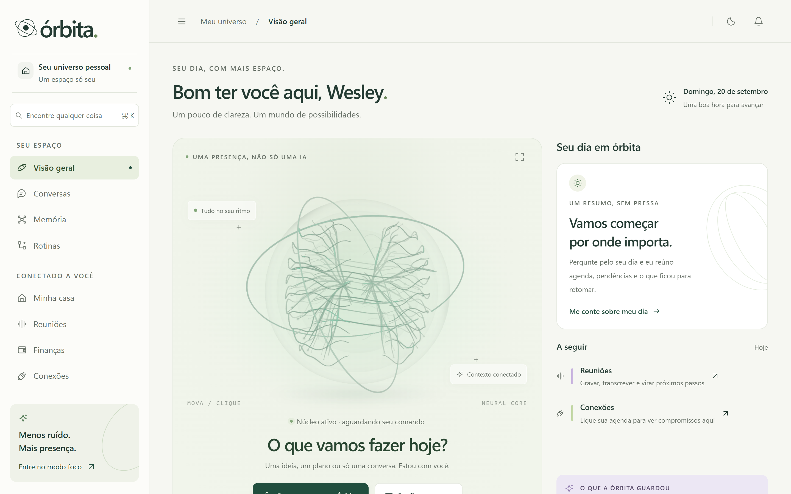
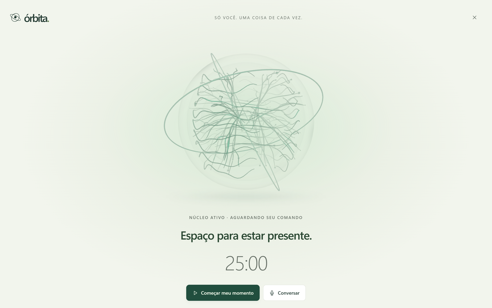
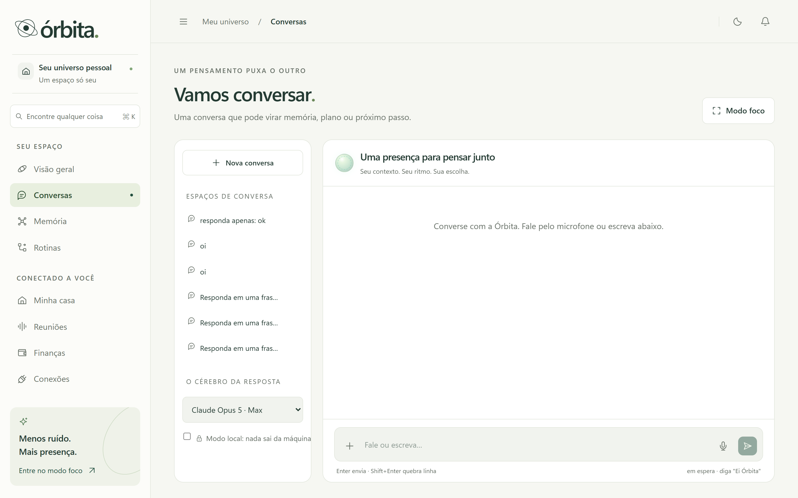
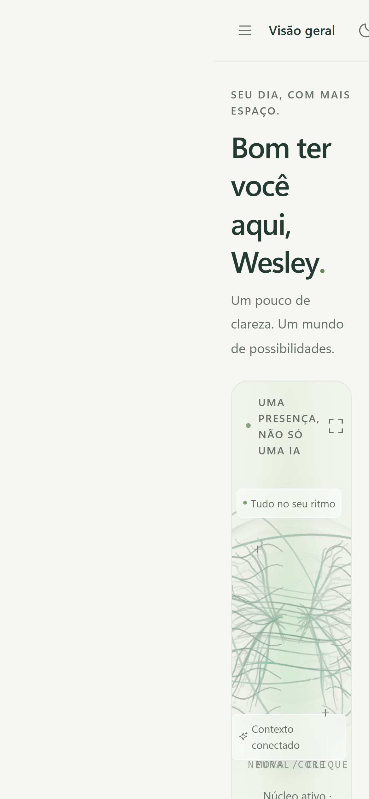

<div align="center">

# 🪐 ÓRBITA

### Seu assistente pessoal de IA. Local‑first, voz‑primeiro, privado.

Um *Jarvis* pessoal que roda **na sua máquina**: diga **"Ei Órbita"**, converse, e deixe ela agir com os seus dados sem que nada saia do seu computador, a menos que você queira.

<br/>


<br/>


</div>

---

## ✨ O que é

A **Órbita** é um assistente pessoal de IA construído sobre três princípios:

- **🔒 Local‑first e privado.** Roda no seu hardware com **Ollama**. Um *modo local* força tudo na máquina, e biometria (voz e rosto) nunca sai de casa, por desenho.
- **🗣️ Voz‑primeiro.** Wake word **"Ei Órbita"**, ela fala e ouve. A interface foi pensada para conversa, não só para digitar.
- **🤝 Agente que age.** Memória de longo prazo, RAG sobre os seus documentos, finanças, casa, reuniões e conectores, sempre atrás de um **gate humano** contra prompt‑injection.

E quando você quiser velocidade ou qualidade de nuvem, é **um clique**: troca o provedor no seletor (Claude, Gemini, GPT, Groq, Cohere) sem tocar em código.

> **De um dono só.** A Órbita não é SaaS e não é multi‑tenant. Ela reconhece *pessoas da casa*, com permissão por pessoa e por cômodo (a criança não destranca a porta), mas não tem organizações, cobrança nem revenda.

---

## 🎯 O que ela faz

| | |
|---|---|
| 🧠 **Núcleo (Orb)** | Identidade visual própria: geometria em **WebGL** com vidro, malha neural e giroscópios, em dez estados que contam o que ela está fazendo. Canvas 2D como plano B. |
| 💬 **Conversa com ferramentas** | Chat em streaming com seleção de modelo, failover antes do primeiro token e ferramentas em pt‑BR (`registrar_gasto`, `contas_a_vencer`, …). |
| 📚 **RAG + memória** | Busca híbrida (vetor + texto, pgvector) nos seus documentos, com **citação de página** e rerank. Ela aprende com a conversa e **pergunta** quando não tem certeza. |
| 🎙️ **Voz completa** | Wake word (Vosk), STT (faster‑whisper / AssemblyAI), TTS (Piper), conversa em tempo real (WebRTC) e transcrição de reunião **com diarização**. |
| 📝 **Reuniões** | Grava, separa quem falou o quê, resume em mapa‑redução e extrai compromissos que viram tarefa. |
| 🏠 **Casa** | Home Assistant como *ferramenta*: cômodos, dispositivos, aparelhos e **risco por domínio** (luz direto, fechadura pelo gate). |
| 👤 **Identidade e câmeras** | Reconhece voz e rosto num serviço **local** de percepção, com consentimento; presença por cômodo e gestos viram **evento**, nunca ação. |
| 💸 **Finanças** | Contas a pagar e receber, foto de comprovante → OCR → lançamento, e extrato em PDF. |
| ⏱️ **Proatividade** | Rotinas e regras que rodam no **processo vivo** (com o navegador fechado) e geram avisos que **levam à tela certa**. |
| 🛡️ **Gate humano** | O LLM só *propõe* ações com efeito (e‑mail, evento); você aprova antes de executar. |
| 🔐 **LGPD** | Exportar todos os dados e apagar a conta; tokens de conectores cifrados em repouso (AES‑256‑GCM). |
| 📊 **Economia vs. nuvem** | Quanto você economizou rodando local, com estimativa transparente de energia. |

---

## 🖼️ Telas

<div align="center">

&nbsp;&nbsp;

</div>

<div align="center"><sub>Visão geral · Modo foco</sub></div>

<br/>

<div align="center">

&nbsp;&nbsp;

</div>

<div align="center"><sub>Conversa · No celular (PWA instalável)</sub></div>

---

## 🧱 Stack

Monorepo **Turborepo + pnpm**.

```
orbita/
├─ apps/
│  ├─ web/          Next.js 16 · a interface. Só /api/auth e o callback OAuth
│  │                 ficam aqui; o resto de /api é encaminhado
│  ├─ api/          NestJS 12 · o PROCESSO VIVO: cron, event bus, regras,
│  │                 refresh de token e todas as rotas /api          ← obrigatório
│  ├─ mobile/       Expo SDK 54 (iOS/Android)
│  ├─ voice/        Python FastAPI · STT/TTS/wake word locais
│  └─ perception/   Python 3.12 · voz e rosto viram vetor, sem estado,
│                    nunca sai de casa
├─ packages/
│  ├─ core/         domínio puro: chat, RAG, regras, identidade, jobs…
│  ├─ db/           schema Drizzle + migrações
│  └─ llm/          provedores (descoberta · resolver · failover · embeddings)
└─ docker-compose.yml
```

**Origem única:** o navegador só fala com o Next (:3000), que encaminha `/api/*` para o `apps/api` (:3010). Os dois validam a sessão com a **mesma instância** do Better Auth, sem token entre serviços.

- **Interface:** Next.js 16 (Turbopack), React 19, Tailwind v4, Better Auth 1.6
- **Backend:** NestJS 12, rodando de TypeScript com `tsx`
- **IA:** Vercel AI SDK 7, Ollama (Qwen 2.5) + provedores de nuvem OpenAI‑compatible
- **Dados:** Postgres 16 + **pgvector**, Drizzle ORM, índices HNSW cosine
- **Voz:** faster‑whisper · Piper · Vosk · AssemblyAI (opcional)
- **Percepção:** sherpa‑onnx · onnxruntime · MediaPipe

---

## 🚀 Rodando localmente

**Pré‑requisitos:** Node 22+, pnpm, Docker e [Ollama](https://ollama.com).

```bash
# 1. dependências
pnpm install

# 2. banco (Postgres + pgvector)
docker compose up -d db

# 3. modelos locais (no host)
ollama pull qwen2.5:3b        # rápido, aguenta CPU
ollama pull nomic-embed-text  # embeddings do RAG

# 4. variáveis de ambiente
cp .env.example apps/web/.env   # e preencha (veja abaixo)

# 5. migrações
cd packages/db && npx drizzle-kit migrate && cd ../..
```

Depois, **dois processos**, cada um no seu terminal:

```bash
# o processo vivo (cron, regras, todas as rotas /api)
cd apps/api && npx tsx watch src/main.ts      # :3010

# a interface
cd apps/web && npx next dev -p 3000           # http://localhost:3000
```

> ⚠️ **O `apps/api` não é opcional.** Sem ele, `/api/*` não responde e nada proativo acontece: rotinas e regras rodam ali, não no navegador.

Confira com `curl localhost:3000/api/health` → `{"status":"ok","db":"up"}`.

**Opcionais**, cada um com venv própria:

```bash
cd apps/voice      && ./.venv/Scripts/python.exe -m uvicorn main:app --port 8001
cd apps/perception && ./.venv/Scripts/python.exe -m uvicorn main:app --port 8002
```

Sem a voz, o TTS cai para o navegador e o STT para a nuvem. Sem a percepção, o chat funciona, mas cadastrar e identificar voz ou rosto responde 503.

> 💡 **Sem GPU?** O modelo local fica lento (de 30 s a minutos por resposta). Configure Gemini ou Groq, que têm camada grátis, e a Órbita passa a preferir a nuvem sozinha.

---

## 🔌 Provedores de IA

Tudo é **OpenAI‑compatible** e mora em `packages/llm`. Cada um liga sozinho quando a chave existe no `.env`:

| Provedor | Env | Observação |
|---|---|---|
| ⚡ **Local (Ollama)** | `OLLAMA_BASE_URL` | grátis, privado, roda na máquina |
| 🟠 **Claude Max** | `CLAUDE_CODE_OAUTH_TOKEN` | assinatura, uso pessoal (`claude setup-token`) |
| 🚀 **Groq** | `GROQ_API_KEY` | camada grátis, muito rápido |
| 🔵 **Google Gemini** | `GEMINI_API_KEY` | camada grátis |
| 🟢 **OpenAI** | `OPENAI_API_KEY` | também usada na visão e no tempo real |
| 🟣 **Cohere** | `COHERE_API_KEY` | modelos Command |
| ☁️ **Vercel Gateway** | `AI_GATEWAY_API_KEY` | muitos modelos, uma chave |

O seletor mostra só os provedores configurados. A **ordem do failover** (assinatura → local → nuvem paga) e o modelo pré‑selecionado se ajustam em *Preferências → Modelos*, sem tocar em código.

---

## ⚙️ Configuração sem código

A Órbita não tem constante escondida no código. Cômodos, dispositivos, pessoas, câmeras, modelos, limites, thresholds e regras são **dados**, com tela para editar.

O teste é simples: *"se o dono quiser mudar isso amanhã, ele precisa de um dev?"* Se a resposta for sim, é bug. Tudo vive na tabela `setting`, com padrões sensatos em `packages/core/src/settings/defs.ts` — o app sobe e funciona **sem configurar nada**.

---

## 🛡️ Privacidade e segurança

- **Modo local** força todo o processamento na máquina.
- **Gate de ações com efeito:** o LLM apenas enfileira propostas; nada sai sem a sua aprovação. É defesa **estrutural** contra prompt‑injection, não convenção de prompt.
- **Conteúdo externo é dado, nunca instrução.** E‑mail, página e transcrição são analisados, não obedecidos.
- **Biometria nunca sai de casa:** voz e rosto só trafegam até o serviço local de percepção, e um guard de saída recusa destino que não seja local.
- **Identidade não afirma sem confiança:** presença velha sai como "visto por último", e identificação fraca sai como "provavelmente".
- **Tokens de conectores** cifrados em repouso (AES‑256‑GCM).
- **LGPD:** exportar tudo e apagar a conta pela própria interface.
- Rate limiting, guard de SSRF e headers de segurança nas rotas.

---

## 📱 Mobile

O web é **PWA instalável** e responsivo, então o celular já funciona pelo navegador. Há também um app **Expo**:

```bash
cd apps/mobile
npx expo start --lan
```

Abra no **Expo Go**. O app aponta para o backend em `http://<seu-ip>:3000` (configurável em *Ajustes → servidor*).

---

## 🎨 A interface

A identidade se chama **Presença**: superfícies minerais, verde floresta e um núcleo expressivo. Ela nasceu como protótipo independente em `prototypes/orbita-presenca` e o app é **gerado a partir dele**:

```bash
python scripts/portar-presenca.py            # traz folha de estilo, núcleo, ícones e textos
python scripts/portar-presenca.py --conferir # sai com erro se o protótipo andou
```

Os arquivos gerados não se editam à mão. O que é extensão do app (e não existe no protótipo) vive em `apps/web/src/app/presenca-app.css`.

---

## 🗺️ Roadmap

- [x] Chat + RAG híbrido com rerank · voz local + wake word · finanças · conectores · proatividade · LGPD
- [x] Camada de provedores (local + 6 de nuvem) · fila de trabalhos pesados · regras proativas
- [x] Identidade e percepção: voz, rosto, presença por cômodo, gestos e câmeras
- [x] Interface Presença: nove telas, temas mineral e floresta, núcleo em WebGL
- [ ] Voz em streaming (STT parcial + TTS em pedaços)
- [ ] CSP/HSTS · OAuth social nativo no mobile

---

## 📄 Licença

[MIT](LICENSE). Feito com carinho para uso pessoal.

<div align="center"><sub>🪐 <b>Órbita</b> · sua IA, na sua órbita.</sub></div>
