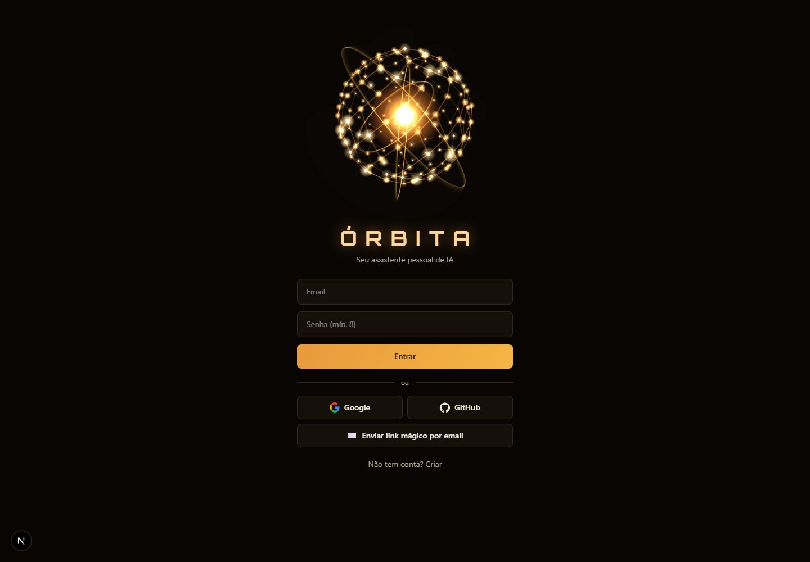
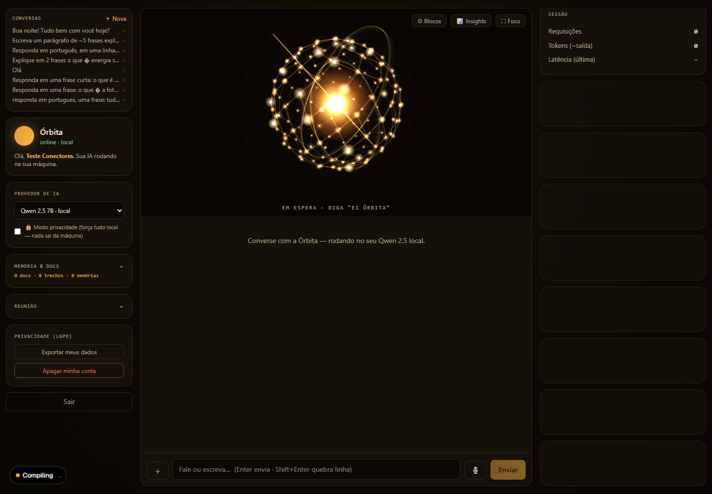
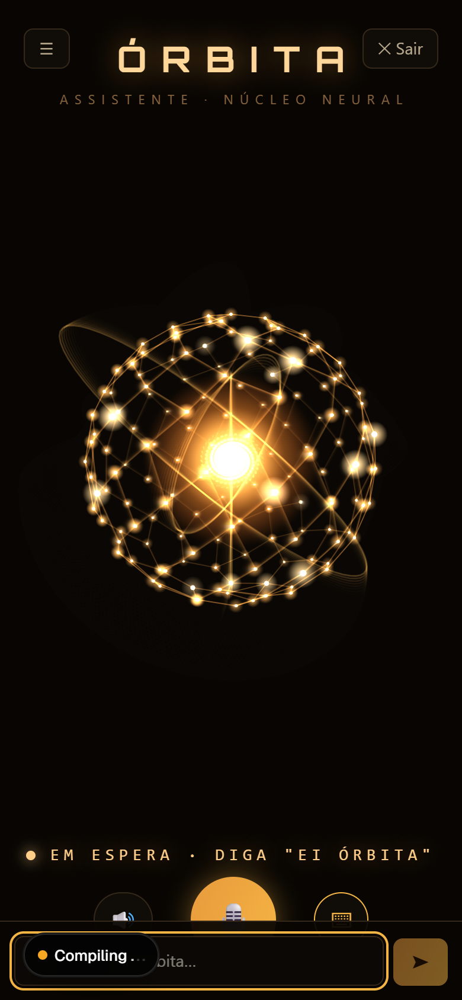

<div align="center">

# 🪐 ÓRBITA

### Seu assistente pessoal de IA. Local‑first, voz‑primeiro, privado.

Um *Jarvis* pessoal que roda **na sua máquina**: diga **"Ei Órbita"**, converse, e deixe ela agir com os seus dados sem que nada saia do seu computador, a menos que você queira.

<br/>


<br/>



</div>

---

## ✨ O que é

A **Órbita** é um assistente pessoal de IA construído sobre três princípios:

- **🔒 Local‑first e privado.** Roda no seu hardware com **Ollama**. Um *modo privacidade* força tudo local, nada vai para a nuvem.
- **🗣️ Voz‑primeiro.** Wake word **"Ei Órbita"**, ela fala e ouve. Interface pensada para conversa, não só para digitar.
- **🤝 Agente que age.** Memória de longo prazo, RAG sobre os seus documentos, finanças, tarefas e conectores (Gmail, Agenda, Notion, Slack), sempre atrás de um **gate humano** contra prompt‑injection.

E quando você quiser velocidade ou qualidade de nuvem, é **um clique**: troca o provedor no seletor (Claude, Gemini, GPT, Groq, Cohere) sem tocar em código.

---

## 🎯 Destaques

| | |
|---|---|
| 🧠 **Núcleo neural (Orb)** | Identidade visual estilo *Homem de Ferro*, animada em Canvas, idêntica no web e no mobile. |
| 🔌 **Camada de provedores** | Local (Ollama) · Claude Max · Groq · Google Gemini · OpenAI · Cohere · Vercel Gateway. Troca no seletor, cada um atrás de uma env. |
| 📚 **RAG + memória** | Busca semântica (pgvector) nos seus documentos e memórias, com citação de fonte e cortes anti‑alucinação. |
| 🎙️ **Voz completa** | Wake word (Vosk), STT (faster‑whisper / AssemblyAI), TTS (Piper), conversa mãos‑livres e transcrição de reunião. |
| 💸 **Finanças** | Gastos, contas a pagar e receber, foto de comprovante → OCR → lançamento, e extrato em PDF. |
| ✅ **Proatividade** | Rotinas agendadas que geram avisos e **notificações push** sozinhas. |
| 🛡️ **Ações com gate humano** | O LLM só *propõe* ações com efeito (e‑mail, evento); você aprova antes de executar. |
| 🎛️ **Modo foco** | Tela cheia, voz‑primeiro, com o Orb no centro. No celular, abre direto nele. |
| 🔐 **LGPD** | Exportar todos os dados e apagar a conta; tokens de conectores cifrados em repouso (AES‑256‑GCM). |
| 📊 **Economia vs. nuvem** | Painel que mostra quanto você economizou rodando local, com estimativa transparente de energia. |

---

## 🖼️ Telas

<div align="center">

&nbsp;&nbsp;

</div>

<div align="center"><sub>Dashboard completo (desktop) · Modo foco voz‑primeiro (celular)</sub></div>

---

## 🧱 Stack

Monorepo **Turborepo + pnpm**.

```
orbita/
├─ apps/
│  ├─ web/      Next.js 16 · UI + API (route handlers) + Orb        ← app principal
│  ├─ mobile/   Expo SDK 54 (iOS/Android) · mesma identidade
│  └─ voice/    Python (FastAPI) · STT/TTS/wake word locais
├─ packages/
│  └─ llm/      camada de provedores (catálogo · resolver · failover · embeddings)
└─ docker-compose.yml
```

- **Front/API:** Next.js 16, React 19, Tailwind v4, Better Auth 1.6
- **IA:** Vercel AI SDK 7, Ollama (Qwen 2.5) + provedores de nuvem via OpenAI‑compatible
- **Dados:** Postgres + **pgvector**, Drizzle ORM
- **Voz:** faster‑whisper · Piper · Vosk (wake word) · AssemblyAI (opcional)
- **Mobile:** Expo Router, react‑native‑webview (Orb)

---

## 🚀 Rodando localmente

**Pré‑requisitos:** Node 20+, pnpm, Docker, e [Ollama](https://ollama.com) instalado.

```bash
# 1. dependências
pnpm install

# 2. banco (Postgres + pgvector via Docker)
docker compose up -d db

# 3. modelos locais (no host)
ollama pull qwen2.5:3b        # rápido, bom para CPU
ollama pull nomic-embed-text  # embeddings do RAG

# 4. variáveis de ambiente
cp .env.example apps/web/.env   # e preencha o que quiser (veja abaixo)

# 5. migração do banco
pnpm --filter @orbita/web db:migrate

# 6. subir o app
pnpm --filter @orbita/web dev   # http://localhost:3000
```

> 💡 **Sem GPU?** O modelo local fica lento. Configure Claude / Gemini / Groq (abaixo) e ele vira o padrão automaticamente. Para máxima fluidez, rode em produção: `pnpm --filter @orbita/web prod`.

Quer tudo num comando? `docker compose up --build` sobe banco + migrations + web + voz (o Ollama fica no host).

---

## 🔌 Provedores de IA

Tudo é **OpenAI‑compatible** e mora na `packages/llm`. Adicionar ou trocar provedor é encaixe, não refatoração. Cada um liga sozinho quando a chave existe no `.env`:

| Provedor | Env | Observação |
|---|---|---|
| ⚡ **Local (Ollama)** | `OLLAMA_BASE_URL` | grátis, privado, roda na máquina |
| 🟠 **Claude Max** | `CLAUDE_CODE_OAUTH_TOKEN` | assinatura, uso pessoal |
| 🚀 **Groq** | `GROQ_API_KEY` | tier grátis, ~500 tok/s |
| 🔵 **Google Gemini** | `GEMINI_API_KEY` | tier grátis |
| 🟢 **OpenAI** | `OPENAI_API_KEY` | também usada na visão e no realtime |
| 🟣 **Cohere** | `COHERE_API_KEY` | modelos Command |
| ☁️ **Vercel Gateway** | `AI_GATEWAY_API_KEY` | muitos modelos, 1 chave |

O seletor da UI mostra só os provedores configurados. Quando o Claude está presente, o **Sonnet 5** é o padrão (nuvem rápida, mesmo com o local disponível).

---

## 🗣️ Voz

O serviço de voz (`apps/voice`, FastAPI) roda o wake word e o STT/TTS locais:

```bash
cd apps/voice
uv run uvicorn main:app --host 0.0.0.0 --port 8001
```

- **Wake word:** "Ei Órbita" via Vosk (pt‑BR)
- **STT:** faster‑whisper local, ou **AssemblyAI** se `ASSEMBLYAI_API_KEY` estiver setada
- **TTS:** Piper (`pt_BR-faber-medium`), com fallback para a voz do navegador

---

## 📱 Mobile

App **Expo** (mesma identidade visual do web). Para rodar:

```bash
cd apps/mobile
npx expo start --lan
```

Abra no **Expo Go** (iOS/Android). O app aponta para o backend em `http://<seu-ip>:3000` (configurável em *Ajustes → configurar servidor*).

---

## 🛡️ Privacidade e segurança

- **Modo privacidade** força todo o processamento local.
- **Gate de ações destrutivas:** o LLM apenas enfileira propostas; nada é enviado sem a sua aprovação (defesa contra prompt‑injection).
- **Tokens de conectores** cifrados em repouso (AES‑256‑GCM).
- **LGPD:** exportar todos os dados e apagar a conta pela própria UI.
- **Rate limiting, SSRF guard e headers de segurança** nas rotas.

---

## ☁️ Deploy

- **Web** → Vercel (aponte a raiz para `apps/web`). Na nuvem, use os provedores de nuvem; os recursos *local‑first* (Ollama, voz local, wake word) são de self‑host.
- **Mobile** → build com **EAS** (Expo) para App Store e Play Store.
- **Voz** → um host de Python (Render / Fly / Railway) ou local.
- **Self‑host completo** → `docker compose up` sobe web + Postgres, com o Ollama no host.

---

## 🗺️ Roadmap

- [x] Chat + RAG + memória · voz local + wake word · finanças · conectores · proatividade · LGPD
- [x] Provider layer (local + 6 provedores de nuvem) · design system · modo foco responsivo
- [ ] Voz em streaming (STT parcial + TTS em chunks)
- [ ] RAG turbo (embedding de nuvem + rerank) · CSP/HSTS
- [ ] OAuth social nativo no mobile

---

## 📄 Licença

[MIT](LICENSE). Feito com carinho para uso pessoal.

<div align="center"><sub>🪐 <b>Órbita</b> · sua IA, na sua órbita.</sub></div>
